# Bienvenue à la compétition Web des CS Games 2025!

The english version is available [here](./README_EN.md).


## Mise en contexte


Pour cette épreuve, vous devrez implémenter un jeu en 2D. Pour se faire, les sections suivantes présenteront le détail de ce qui est attendu. Chaque sections comporent des requis et les points qui y sont associés. Pour chaque section, vous devrez implémenter de manière **chronologique** les différents requis.

**ATTENTION** : Si vous n'implémentez pas les requis en ordre chronologique, seul les points les plus bas vous seront données. Par exemple, si vous implémentez les requis 1, 3, 5. C'est uniquement les points du requis 1 que vous gagnerez. 

## Limites

Vous n'avez pas droit au LLMs, mais vous pouvez faire des recherches sur internet. Vous n'avez pas droit à télécharger des packages npms. Vous pouvez utiliser `react-router-dom` pour vous aider avec la navigation.

## Commande pour exécuter le jeu
Pour exécuter le jeu, vous devrez utiliser la commande suivante dans le dossier frontend: 
```npm run dev```

L'application devrait s'afficher à l'écran.

## Grille d'évaluation

Les sections suivantes feront le détail des implémentations, mais la grille d'évaluation vous est aussi fournit il s'agit du fichier `Correction CSGames - French.pdf`.

## Sections à compléter

### Barre de navigation

1. Créer une barre de navigation permettant aux utilisateurs d’avoir accès aux pages suivantes : Game Page et Easter Egg. À noter que la page « Easter Egg » doit initialement être cachée dans la barre de navigation. **(1 point)**

2. Placer la barre de navigation sur le côté gauche de l’écran. **(3 points)**

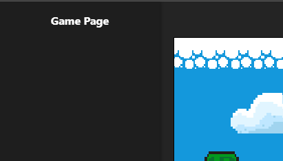


3. Faire en sorte que la barre de navigation puisse être rétractable. L’utilisateur doit pouvoir ajuster la largeur de la barre de navigation à l’aide de son curseur. Lorsque la barre de navigation devient trop petite, un emoji doit remplacer le texte. Par exemple, lorsque la barre est en expansion, on devrait y voir Game Page et Easter Egg. Lorsque la barre est contractée, on devrait y voir 🌟 et 🐣. **(5 points)**

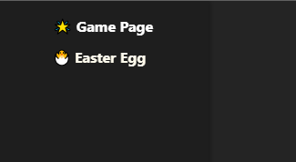

## Game Page

## Arbres

1. Ajouter un arbre de chaque type : 🌳 🌴 🏝️ **(1 point)**

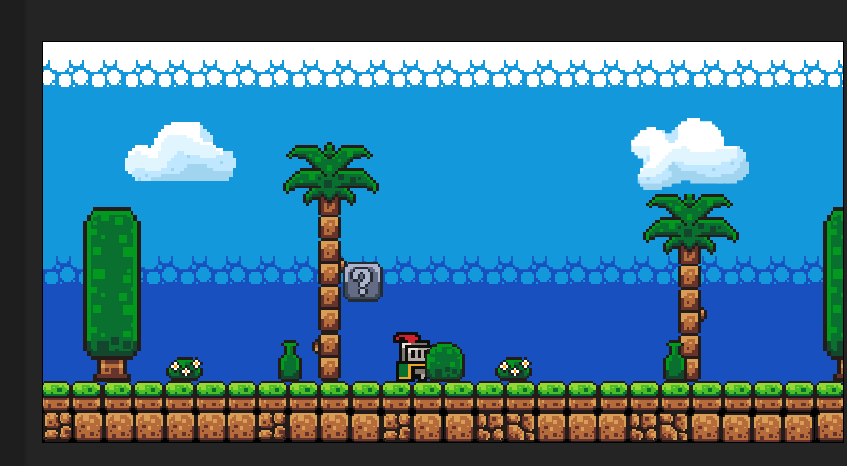

2. Lorsque l’utilisateur appuie sur la barre d’espace, le tronc du palmier doit réduire de taille jusqu’à disparaître complètement. Une trace du coup doit également être présente. **(2 points)**

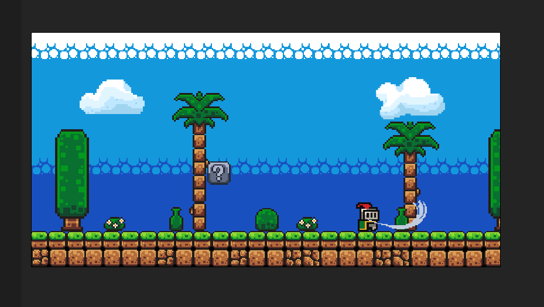

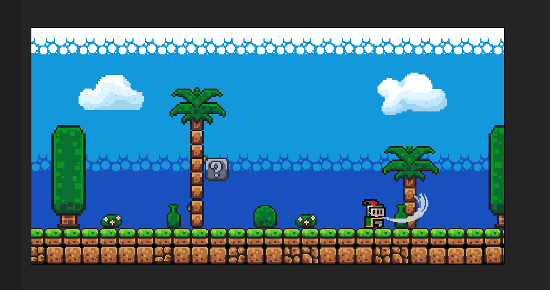

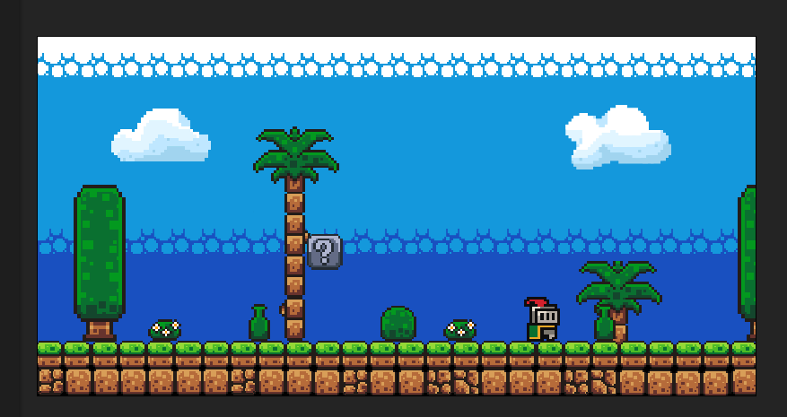

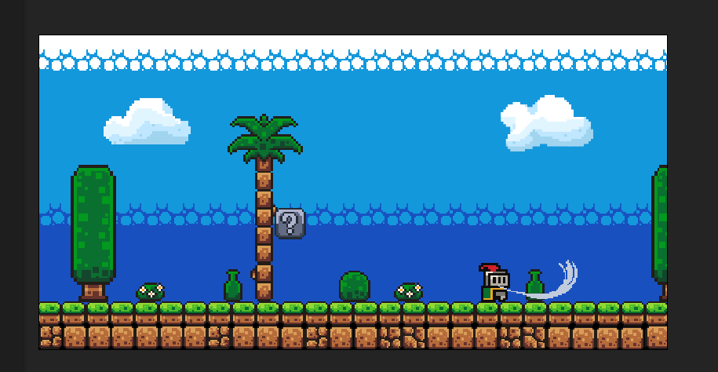


3. Une liste des arbres doit être présente sous le canvas. Cette liste doit itérer à travers l’ensemble des arbres présents dans le canvas. On doit pouvoir y voir la position en X de chaque arbre ainsi que son illustration. Lorsqu’un arbre disparaît à l’étape précédente, il ne doit plus être affiché dans la liste. **(3 points)**

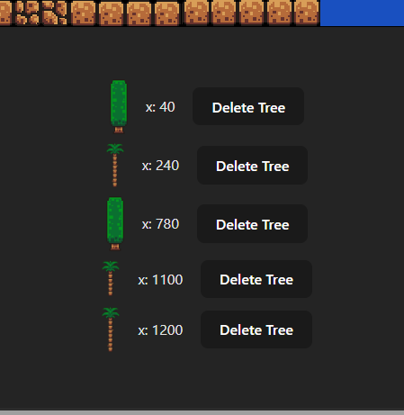

4. Un bouton « Add Tree » et un bouton « Delete Tree » doivent être présents pour permettre à un utilisateur d’ajouter et de supprimer un arbre. Lorsqu’un utilisateur clique sur le bouton « Add Tree », une fenêtre modale doit apparaître afin de lui permettre de choisir le type d’arbre souhaité. L’arbre doit apparaître à une position aléatoire. Lorsque l’utilisateur clique sur le bouton « Delete Tree », l’arbre doit être retiré de la liste. **(4 points)**

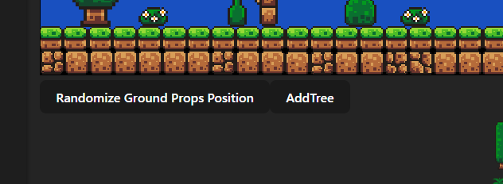

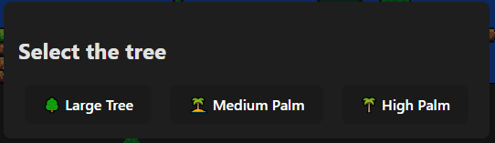


5. Lorsque l’utilisateur clique avec sa souris sur un arbre, il doit être possible de redimensionner sa taille. Une boîte avec des nœuds doit apparaître autour de l’arbre, permettant à l’utilisateur d’augmenter ou de diminuer la hauteur et la largeur de celui-ci. **(5 points)**

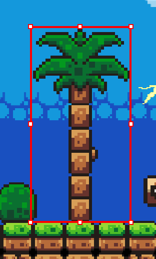

## Cube Mystère
1. Ajouter un cube mystère [ ? ] **(1 point)**

2. Lorsque le joueur entre en contact avec le cube mystère [ ? ], un effet sonore doit être exécuté. **(2 points)**

3. Lorsque le joueur entre en contact avec le cube mystère [ ? ], un champignon rouge doit apparaître sur le cube. **(3 points)**

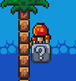

4. Lorsque le joueur entre en contact avec le cube mystère [ ? ], le cube doit bloquer le personnage. Il ne doit pas être possible pour le personnage de passer à travers le cube. **(4 points)**

5. Le cube mystère doit avoir une animation (gif) **(5 points)**

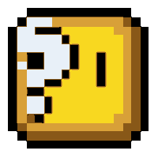

## Champignon

1. Lorsque le joueur entre en contact avec un champignon, le champignon 🍄 doit disparaître et un effet sonore doit être exécuté. **(1 point)**

2. La première fois que le joueur « mange » un champignon (le fait disparaître), l’onglet 🐣 Easter Egg, initialement caché dans la barre de navigation, doit apparaître. À noter qu’un emoji doit également apparaître à côté de chaque nom de page dans la barre de navigation : 🌟 Game Page & 🐣 Easter Egg. **(2 points)**


3. La deuxième fois que le joueur « mange » un champignon (le fait disparaître), une fenêtre modale doit apparaître et permettre à l’utilisateur de choisir l’un des trois personnages disponibles : le chevalier, le bol de poisson ou le chevalier avec des lunettes. Le choix du personnage doit être persistant. Lorsqu’on rafraîchit la page, le choix du personnage doit être conservé. **(3 points)**


4. La troisième fois que le joueur « mange » un champignon (le fait disparaître), une trace fantôme du personnage doit être présente. Les traces les plus récentes doivent être opaques, tandis que les traces les plus anciennes doivent être transparentes. **(4 points)**

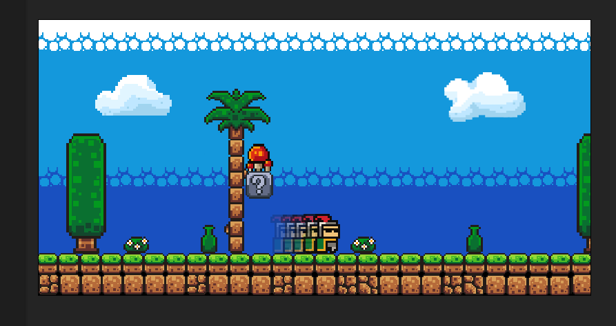

5. La trace fantôme du personnage doit être de couleur arc-en-ciel. Vous ne pouvez pas utiliser d’outils comme Photoshop pour vous aider ; vous devez coder une fonction permettant de modifier la couleur du png fourni. **(5 points)**

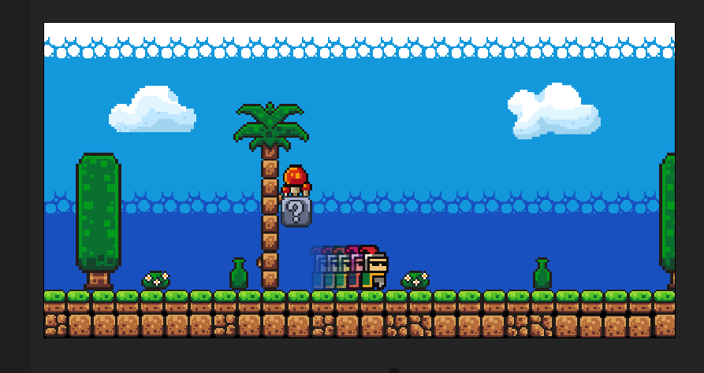


## Nuages

1. Ajouter l'ensemble de nuages ☁️ ☁️ ☁️. **(1 point)**

2. Lorsque le joueur est en face de la pancarte avec un symbole de nuage et que celui-ci appuie sur la barre d'espace, un effet sonore de tonnere doit être produit. Un éclaire doit aussi appraître sur deuxième nuage. **(2 point)**


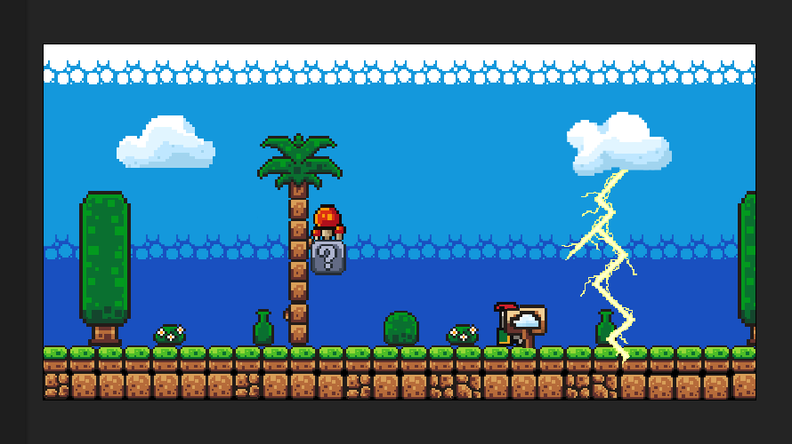


3. Lorsque le joueur est en face de la pancarte avec un symbole de nuage et qu’il appuie sur la barre d’espace, les couleurs du canvas doivent être inversées pendant la durée de l’effet sonore du tonnerre. **(3 point)**


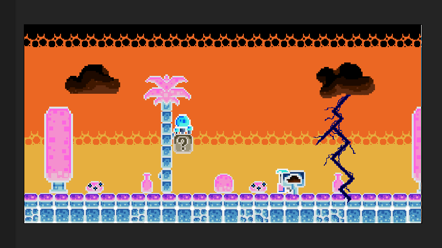

4. Lorsque le son de tonnerre survient, le thème de l’application doit passer d’un thème clair à un thème foncé. Le thème sombre de l’application doit être persistant. **(4 point)**

5. Une fois que les couleurs du canvas sont redevenues normales, les nuages doivent commencer à pleuvoir. Les gouttelettes doivent être de différentes grandeurs et tailles afin de donner une illusion de profondeur. Lorsque les gouttelettes entrent en contact avec le sol, elles doivent produire des éclaboussures. **(5 point)**

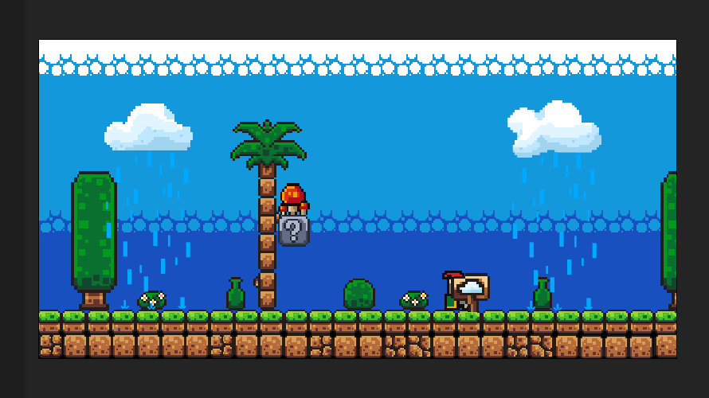


## Objets sur le sol
1. Ajouter un objet destiné au sol de chaque type (bouteilles, buissons, fleurs) (au moins un de chaque). **(1 point)**

2. Un bouton « Random » doit être présent. Lorsque l’utilisateur appuie sur ce bouton, les éléments doivent obtenir une nouvelle position aléatoire sur le sol. **(2 points)**


3. La position des objets doit être persistante, c’est-à-dire que si l’on rafraîchit la page, les objets doivent rester aux mêmes endroits (persistance des objets). **(3 points)**

4. Lorsqu’un utilisateur clique sur un objet (bouteille, buisson ou fleur) présent sur le sol, il doit être possible de le déplacer par glisser-déposer (drag and drop). Autrement dit, lorsqu’un objet est sélectionné à l’aide du bouton gauche de la souris, il doit être possible de modifier sa position jusqu’à ce que le bouton de la souris soit relâché. **(4 points)**

5. Lorsque l’utilisateur repositionne un objet, si celui-ci est relâché dans les airs, l’objet doit être soumis à la gravité et retomber sur le sol. Si l’objet est placé sous le sol, il doit réapparaître à sa position initiale. Une image fantôme de l’objet doit rester présente à la position initiale jusqu’à ce que l’objet puisse être positionné à une nouvelle position valide. **(5 points)**

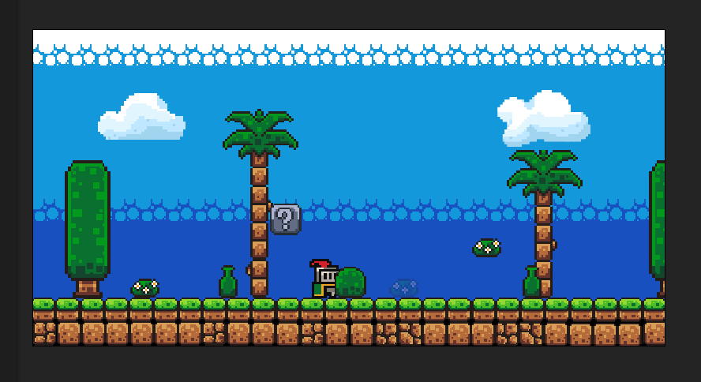


### Easter Egg

1. Créer la page Easter Egg. **(1 point)**

2. Afficher le nom de votre université, le nom de chaque personne ayant réalisé le défi ainsi que le nom de votre équipe. **(5 points)**

3. Créer un meme en lien avec le thème rétro. **(10 points)**

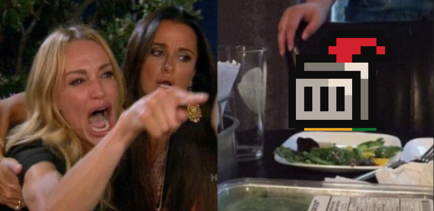


### Expérience Utilisateur (UI/UX)

1. Qualité de l'expérience utilisateur et de l'interface graphique **(10 points)**
